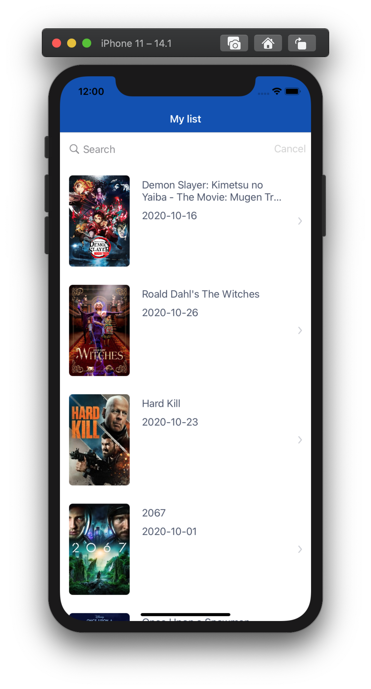
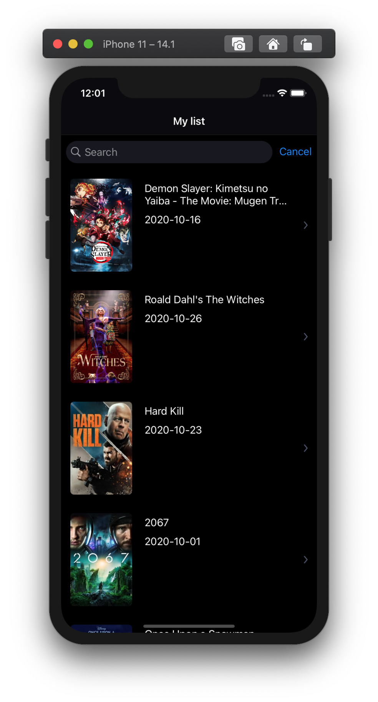
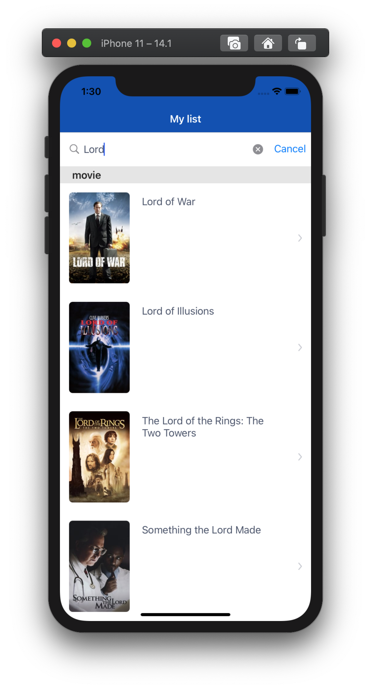
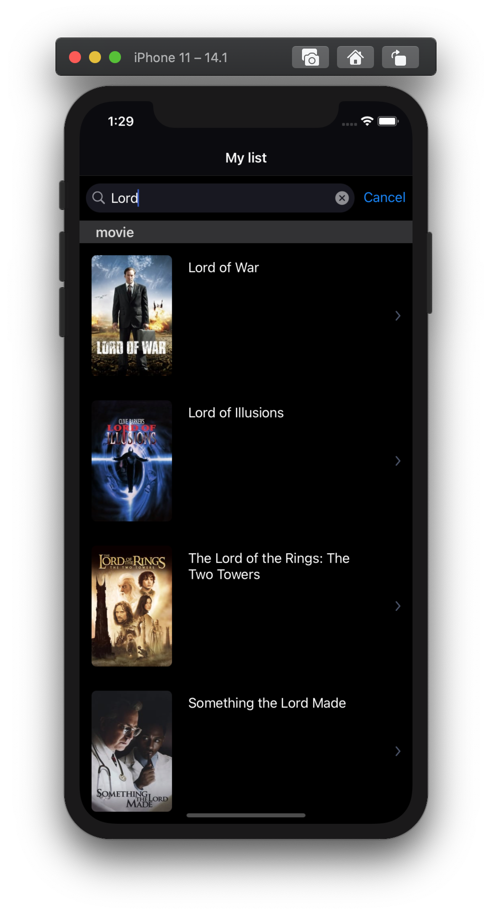
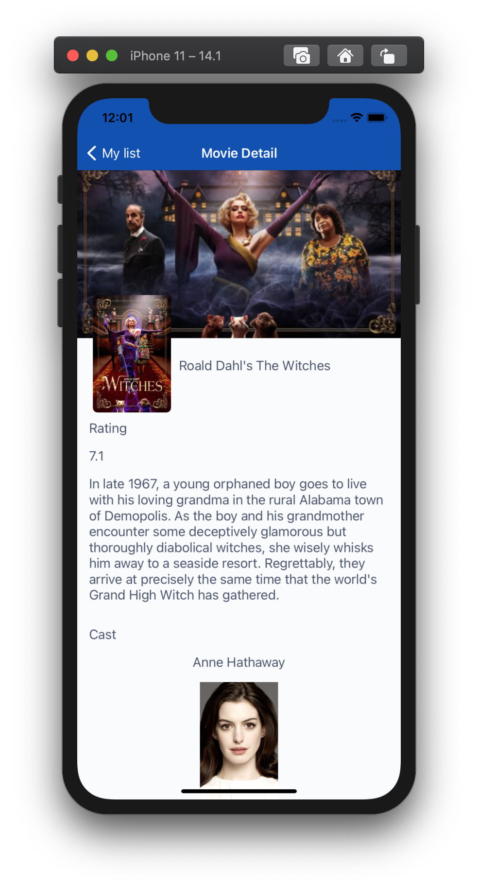
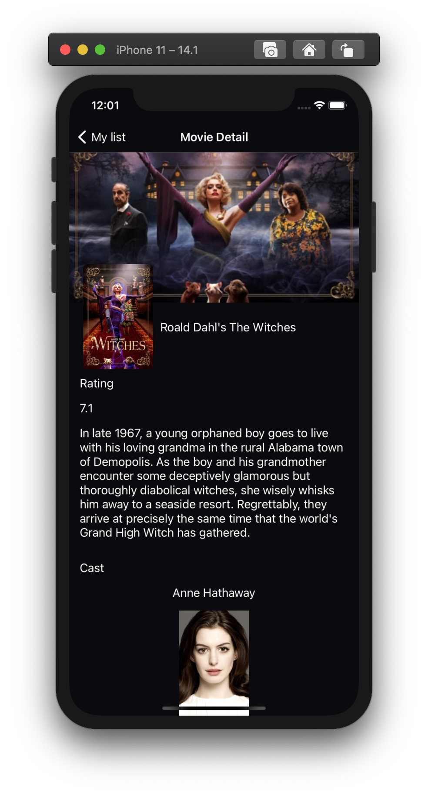
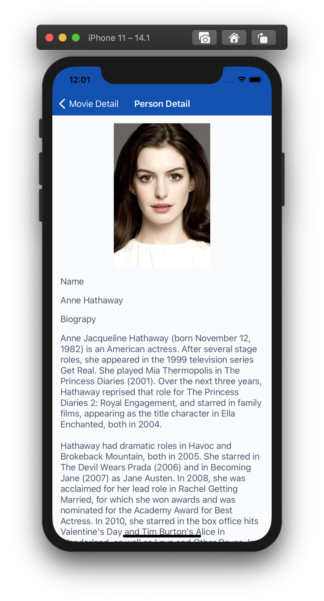
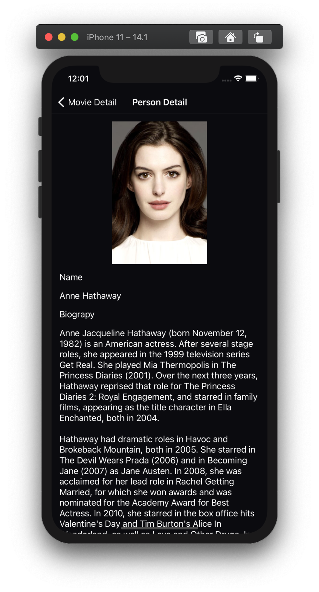

[GitHub-Repository] (https://github.com/mcany/MYMovieDB)

       

#  MYMovieDB

## Features

- Minimum deployment target is set to iOS 10.0

- Light and dark theme is supported.

- Async image loading is supported.

- Keyword search is supported by throttling.

## Scenes

### Movie List

- Fetches and lists popular movies from most recent to least.

- Only the first page of popular movies is patched. (Pagination is in progress).

- Search bar searches the given keyword and finds possible movies, tv or person matches in a sectioned view.

- The selection of each list will navigate to the related detail page. (TV shows detail page is not implemented).

### Movie Detail

- Movie's poster, backdrop, title, rating, overview, and cast list are shown

- Selection of a cast will navigate to the person detail page

### Person Detail

- Person's poster, name, biography, birthplace, birthday, and department info are shown

## Code Architecture

- MVVM architecture is used for making modular, easy to maintain, reusability, and testing purposes.

- Protocol-based programming is used whenever possible to be able to mock data in unit testing and using the same VC with different MVs if needed.

- In list view scene network layer models and presentation layer models are separated.

- Navigation is supported by 'Routers'. This way VCs do not where to go and the creation of the next VC is given to the router for low coupling. Routers decide with given information about where to go when needed.

- Reactive approach is used with State Change Handlers. This way VCs observe view state and reacts to any changes. This approach is used for making dummy VCs and leverages the benefits of the Observer/Observable pattern. VMs do not call directly VCs only updates the state and VCs behave according to any changes without knowing who changed or when is changed.

- Categories are added when needed instead of subclasses in order to make the new features available without changing the base classes. Subclassing is a bigger footprint in the code but used when the extension is not enough.

- No Storyboard is used. Views and constraints are created programmatically. Programmatic creation benefits at merge conflicts, reusability, easy to code review, to read, and clear. Storyboards may take a long time render when it is cluttered. Since using segues does not allow custom VC creation, dependency injection can not be supported. For making VC less crowded and taking advantage of the visual designing Xib files can be used alongside programming.

## Network

- For parsing swift codable protocol is used.

- To make the app lightweight and be independent of the frameworks, a URL session is used.

## Testing

- Example of unit tests is added by using the power of the architecture.